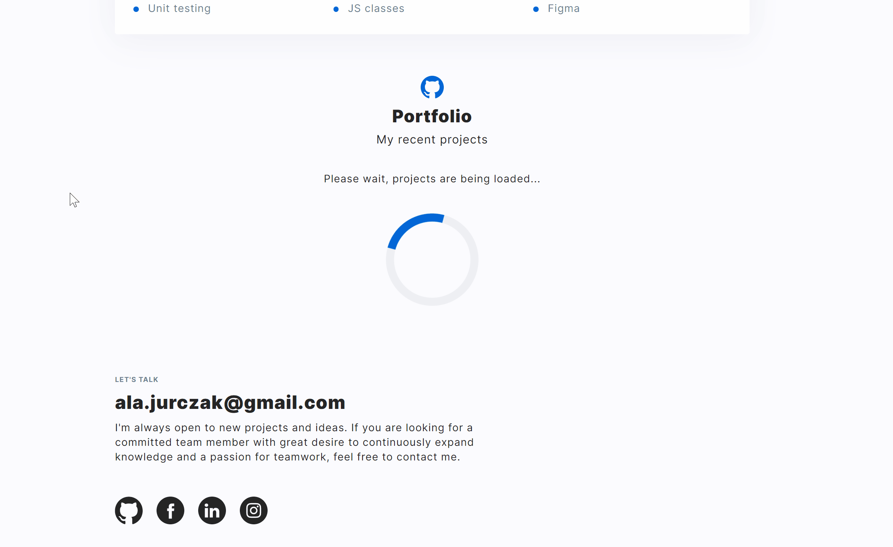

# Personal homepage

## The lastest version here: [Personal homepage](https://alajurczak.github.io/personal-homepage-react/)

## Introduction

This site was created as a virtual equivalent of CV. You can find here information about me, such as:

- my skills 🛠
- my recent projects 👩🏻‍💻
- my strengths 💪🏻
- what I want to learn in the near future 🚀
- how to reach me 📧

This project includes recent projects that I have made and others that I am still working on. They were added using the API. It also includes error handling and loading page.

## Technologies

## Getting Started with Create React App

This project was bootstrapped with [Create React App](https://github.com/facebook/create-react-app).

## Available Scripts

In the project directory, you can run:

### `npm start`

Runs the app in the development mode.\
Open [http://localhost:3000](http://localhost:3000) to view it in your browser.

The page will reload when you make changes.\
You may also see any lint errors in the console.

### `npm run build`

Builds the app for production to the `build` folder.\
It correctly bundles React in production mode and optimizes the build for the best performance.

The build is minified and the filenames include the hashes.\
Your app is ready to be deployed!

See the section about [deployment](https://facebook.github.io/create-react-app/docs/deployment) for more information.
